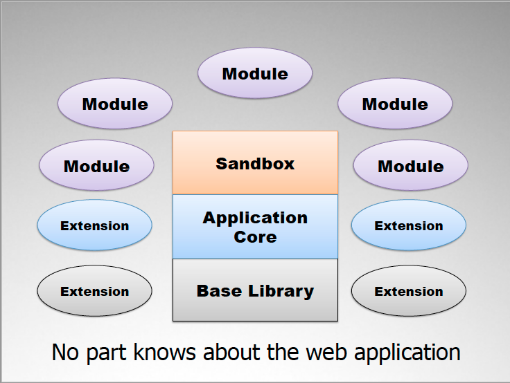

f.js
****

.. image:: https://travis-ci.org/dareenzo/f.js.svg?branch=master
    :target: https://travis-ci.org/dareenzo/f.js
    :alt: Build

.. image:: https://coveralls.io/repos/github/dareenzo/f.js/badge.svg?branch=master
    :target: https://coveralls.io/github/dareenzo/f.js?branch=master
    :alt: Coverage

.. image:: https://img.shields.io/github/license/dareenzo/f.js.svg
    :target: https://github.com/dareenzo/f.js/blob/master/LICENSE
    :alt: License

.. _Riot: http://riotjs.com
.. _React: https://facebook.github.io/react/
.. _Polymer: https://www.polymer-project.org/1.0/
.. _BackboneViews: http://backbonejs.org/#View
.. _Navigo: https://github.com/krasimir/navigo
.. _T3: http://t3js.org
.. _Box: https://github.com/box

Introduction
=============

F is a client-side JavaScript library, which provides a base architecture for
`Single-Page-Applications <https://en.wikipedia.org/wiki/Single-page_application>`_.
It promotes modular development by providing an implementation of the
proven `principles of Scalable JavaScript Application Architecture <https://www.youtube.com/watch?v=mKouqShWI4o>`_
outlined by legendary `Nicholas Zakas <https://github.com/nzakas>`_ in his talks
on the subject.

.. note::

    **This** begun as just an exercise of trying to take the concepts
    outlined in the talk and build something I could use on my apps.

    It **has not been tested in the wild**, thus **it should not be
    considered production-ready**.
    If you're looking for something like this, that is more mature and
    production-ready, then you should definitely check out the T3_
    implementation made by Box_ in collaboration with Nicholas himself,
    linked in the `Similar Projects`_ section bellow.

Architecture Components
=======================

Core
----

The ``Core`` contains the main application object that is the heart of
the application architecture.

Responsabilities:

- Manages the lifecyle of modules (registers, starts, renders and stops modules)
- Manages communication between modules using the PubSub/Mediator Pattern
- Manages the application state using `Anchor Interface Pattern <http://gorgogol.org/en/reading/the-anchor-interface-pattern>`_
- Manages application wide features/interfaces such as URL anchor
  (hash fragment), feature containers, cookies
- Manages Errors - Detects, traps, reports and handles errors in the system.
- Be extensible

Services
--------

``Services`` (refered as ``Extensions`` in the talk) augment the
capabilities of the core to keep it relevant and useful.

``Services`` are loaded in your application when it starts. They allow
you to add features to the application, and are available to the ``Modules``
through their ``Sandbox`` or directly via *Dependency Injection*.

``Services`` have access to the **base library** and / or it's plugins,
like jQuery and jQuery plugins.

``Services`` are intended to be reusable pieces of code such as cookie
parsing, Ajax communication, string utilities, and so on.

Sandbox
-------

The ``Sandbox`` is an abstraction of the core that's an API for common
tasks, used by modules.

The ``Sandbox`` uses the `facade pattern <https://en.wikipedia.org/wiki/Facade_pattern>`_
so that you can hide the features provided by the ``Core`` and only show
a well defined custom static long-term API to your ``Modules``. This is
actually one of the most important concept for creating maintainable
apps -- change plugins, implementations, etc. but keep your API stable
for your ``Modules``.

For each ``Module`` a separate ``Sandbox`` will be created, so that the
``Module`` can interact with the ``Core``.

Responsabilities:

- Permissions manager - acts as a security guard for the modules,
  securing what modules can/can't access meaning it knows what a module
  can access and what cannot. It determines which parts of the framework
  the modules can access
- provide a dependable interface for modules
- translate module requests into core actions
- ensures a consistent interface for the modules - modules can rely on
  the methods to always be there

Module
------

As defined by `Nicholas Zakas <http://www.slideshare.net/nzakas/scalable-javascript-application-architecture-2012/15-Any_single_module_should_be>`_,
a web application ``Module`` is:

    an independent unit of functionallity that is part of the total
    structure of a web application, which consists of HTML + CSS + JavaScript
    and which should be able to live on it's own. It's each module's
    job to create a meaningful user experience.

A ``Module`` is a completely independent part of your application which
has absolutely no reference to any another piece of the app, but the
``Sandbox``, which it uses to communicate with the other parts of the
application.

``Modules`` can be easily started, stopped or restarted by the ``Core``.
They subscribe to notifications of interest and rapidly react to changes,
whilst also notifying the app when something interesting happens through
the ``Sandbox``.

``Modules`` manage ``Data`` and ``Views``, though may not have actual objects
representing either. ``Views`` are in turn formed by ``Widgets``, which are
reusable pieces of UI that contain no business logic or data, and can be
shared among many ``Views``.

The ideas around ``Modules``, ``Views`` and ``Widgets`` are pretty close to
rising ideas of `Web components <https://en.wikipedia.org/wiki/Web_Components>`_,
where our ``Modules`` would play the role of the Parent/Controller-``Views``.
Thus, we can implement them or just the child views using any of the
various libraries we desire like Riot_, React_, Polymer_ or BackBoneViews_.

**F**'s API only requires that the module provides the ``start`` and
``stop`` methods so the ``Core`` can manage the ``Modules`` lifecycle, but
other than that its opened to the user the option to implement them
using whatever he likes.

Responsabilities:

- Provides a well-scoped capability to the application.
- Creates and manages its own content (typically HTML and SVG) in a
  container provided by the ``Sandbox``
- Provides a consistent API to the ``Core`` / ``Sandbox`` for configuration,
  initialization, and use.
- Is kept isolated from other features by using unique and coordinated
  JavaScript and CSS namespaces, and by not allowing any external calls
  except to shared utilities (``Extensions``).

A good ``Module`` implementation should abide by these rules:

- only call your own methods or those in the ``Sandbox``
- don't access DOM elements outside of your box
- don't access non-native global objects
- anything else you need ask the ``Sandbox``
- don't create global objects
- don't directly reference other ``Modules``
- ``Module`` s only know the ``Sandbox`` , the rest of the architecture
  doesn't exist to them
- Manage data and views

One thing that must be beared in mind, is that Modules can and are
comprised of other smaller components/widgets.
The key thing that will turn a component into a module is it's
significance and the features it provides to the user under a given context.
For instance, if we look at a text message component, when considering
if it's a module or not the questions we have to ask are:

- can it live on it's own?
- does it provide a significant feature or meaning on it's own.

So, a ``Module`` will be a set of components that provide a functionality
as a whole and which can live on it's own on the page as a whole.

Getting started
===============

**F** requires the dependencies listed bellow. As long as you have them,
just download the recent-most release from the `releases <./releases>`_
page and include it in your page.

Also check out the examples listed in bellow, they provide a good hint
on how to use the framework.

Dependencies
============

no dependencies ;D

.. note::

    Although the example uses Riot_ for the views and Navigo_ for
    routing, they're not dependencies of the framework, it's just an
    example using them, but it could be anything else.

Examples
========

- `Todos <examples/todos>`_ - An implementation the famous TODOs app by
  `TODO MVC <http://todomvc.com>`_.

  - Start a simple HTTP Server (like ``python -m SimpleHTTPServer`` for example) from the root of the project and browse it.
  - Navigate to the ``examples/todos`` folder and it should show up.

Similar Projects
================

- `T3 <http://t3js.org>`_
- `BackBone Aura <https://addyosmani.github.com/aura>`_
- `ScalableApp <https://github.com/legalbox/lb_js_scalableApp>`_
- `ScaleApp <http://scaleapp.org>`_
- `Hydra.js <http://tcorral.github.com/Hydra.js>`_
- `Kernel.js <http://alanlindsay.me/kerneljs>`_
- `terrifically <http://terrifically.org>`_

Copyright and License
=====================

.. __: https://github.com/dareenzo/f.js/raw/master/LICENSE

Code and documentation are available according to the MIT License.

See the LICENSE__ file for details.
